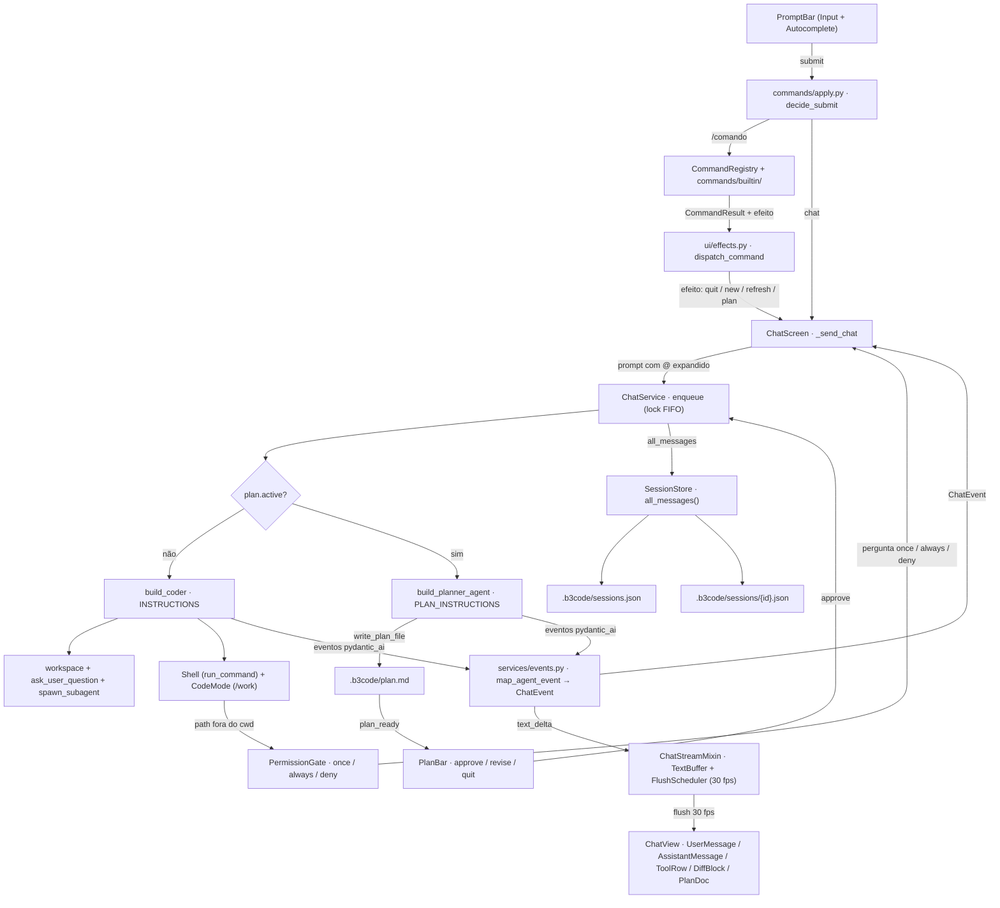

# b3code

TUI minimalista de coding assistant — um chat de terminal que conversa com um
modelo de linguagem e **implementa de verdade**: lê o workspace, edita arquivos
(com diff visual), roda comandos de shell com gate de permissão e persiste as
sessões entre execuções. Construído com **Textual** (interface), **Pydantic AI**
(agentes e ferramentas), **CodeMode** (sandbox de arquivos) e **Azure**
(backend de modelo opcional via gateway).

## 2. Funcionalidades

- Chat com **streaming** e renderização de markdown (uma atualização por frame, 30 fps).
- Anexo de arquivos com `@caminho` — o conteúdo entra no turno do usuário como um bloco `<file>`.
- Comandos `/` com **autocomplete** (comandos, argumentos e arquivos).
- **Dois backends de modelo**: gateway Azure (configurado no JSON) ou catálogo nativo do Pydantic AI.
- **Plan mode**: um agente planejador explora o repo e escreve `.b3code/plan.md`; você aprova, revisa ou sai antes de qualquer implementação.
- **Gate de permissão de shell**: comandos dentro do workspace rodam livres; caminhos fora pedem `once / always / deny`.
- **Sessões persistentes**: índice + mensagens em `.b3code/`, com retomada (`/resume`).
- **Diffs coloridos** com número de linha à esquerda, bandas verde/vermelha na linha inteira e *fold* (`▸`) para recolher/expandir linhas omitidas.
- **Pergunta ao utilizador** (`ask_user_question`): card de escolha no meio do turno.
- **Subagentes**: o coder lança um filho (`explore`, `plan` ou `general-purpose`) com contexto próprio.

## 3. Stack e requisitos

- **Python ≥ 3.12** (ver `.python-version`) e **uv** como gerenciador.
- Dependências principais (`pyproject.toml`):
  - `textual>=1.0` — a TUI.
  - `pydantic-ai-harness[codemode]>=0.18.1` — Shell, CodeMode (mount `/work`) e Planning.
  - `pydantic-ai-slim[openai,mcp]>=2.28.0` — agentes, modelos e cliente MCP.
  - `pydantic>=2.10` — schema de config e modelos de dados.
  - `rapidfuzz>=3.14.5` — fuzzy match do autocomplete de arquivos.
  - `pathspec>=1.1.1` — respeito ao `.gitignore` no índice de arquivos.

## 4. Instalação e primeiro run

```bash
uv sync
uv run b3code
```

No primeiro run, o app cria o arquivo de config no diretório de trabalho
(`.b3code/config.json`). Edite-o com sua chave e endpoint antes de conversar
(ou use o catálogo de modelos do Pydantic AI — veja [Backends de modelo](#6-backends-de-modelo)).

## 5. Configuração

Arquivo: `.b3code/config.json` (criado automaticamente se não existir, gravado
com escrita atômica). Campos espelhando o schema `AppConfig`:

| Campo | Tipo | Default | Descrição |
|---|---|---|---|
| `use_provider_gateway` | bool | `true` | `true` = usa o Azure do JSON (gateway); `false` = catálogo do Pydantic AI. |
| `api_key` | string | `""` | Chave da API do Azure. |
| `api_endpoint` | string | `""` | Endpoint do recurso Azure (ex.: `https://SEU-RECURSO.openai.azure.com/openai/v1/`). |
| `api_models` | list | `["gpt-4o"]` | Modelos listados pelo `/model` quando o gateway está ligado. |
| `selected_model` | string | primeiro de `api_models` | Modelo ativo. No gateway é um item de `api_models`; no catálogo é `provider:model`. |
| `shell_allowed_paths` | list | `[]` | Paths absolutos que o shell pode usar sem perguntar de novo. |
| `selected_theme` | string | `"b3code"` | Slug do tema ativo (o `name` de um item de `themes`). |
| `themes` | list | `b3code` + `github-dark` | Temas salvos. Cada item tem `name` (slug), `label` opcional (exibição) e as cores `background`, `foreground`, `accent`, `muted`, `border`, `surface`, `error`, `success`. Hex inválido volta ao default. JSON antigo com `accent` no topo migra para o tema default. Nome com espaço vira slug + label (`"B3 Light"` → `name: "b3-light"`, `label: "B3 Light"`). |
| `multiline` | bool | `true` | `true` = paste preserva `\\n`; Shift+Enter insere newline. |
| `mcp_servers` | object | `{}` | Servers MCP por nome. Cada um tem `command`+`args`+`env` (stdio) **ou** `url`+`headers` (HTTP/SSE), mais `enabled`, `transport` (`stdio`/`http`/`sse`), `startup_timeout_sec` (30) e `tool_timeout_sec` (120). Tudo vive neste JSON. Aceita `${VAR}` / `${VAR:-default}` na conexão. |

Exemplo:

```json
{
  "use_provider_gateway": true,
  "api_key": "...",
  "api_endpoint": "https://SEU-RECURSO.openai.azure.com/openai/v1/",
  "api_models": ["gpt-4o"],
  "selected_model": "gpt-4o",
  "shell_allowed_paths": [],
  "selected_theme": "b3code",
  "themes": [
    {
      "name": "b3code",
      "label": "",
      "background": "#1c1d1f",
      "foreground": "#e6e8ea",
      "accent": "#00b0e6",
      "muted": "#8b9198",
      "border": "#3c4046",
      "surface": "#26282c",
      "error": "#e05a5a",
      "success": "#3fba7a"
    },
    {
      "name": "github-dark",
      "label": "",
      "background": "#0d1117",
      "foreground": "#e6edf3",
      "accent": "#58a6ff",
      "muted": "#8b949e",
      "border": "#30363d",
      "surface": "#161b22",
      "error": "#f85149",
      "success": "#3fb950"
    }
  ],
  "multiline": true,
  "mcp_servers": {}
}
```

### Temas

O first-run grava dois temas. O ativo e o default gerado é **`b3code`**, com a paleta
institucional da B3 (ciano Pantone 2995 `#00b0e6`). O fundo é cinza-neutro
`#1c1d1f` de propósito — o navy oficial `#003475` no canvas quebra o contraste
de texto e diffs.

| Token | `b3code` | Uso |
|---|---|---|
| `background` | `#1c1d1f` | tela, prompt, barras |
| `foreground` | `#e6e8ea` | texto |
| `accent` | `#00b0e6` | prefixo, plan, tools, hint |
| `muted` | `#8b9198` | ícones, cwd, folds |
| `border` | `#3c4046` | prompt, welcome, autocomplete |
| `surface` | `#26282c` | chips, painéis |
| `error` | `#e05a5a` | erros, diffs `-` |
| `success` | `#3fba7a` | diffs `+` |

`github-dark` (Primer) vem no mesmo JSON. Hex inválido em qualquer token volta
ao default daquele token. JSON antigo com `accent` no topo migra para o tema
`b3code`.

### MCP

Servers ficam em `mcp_servers` no mesmo JSON. O modelo descobre tools com
`search_tools` da lib (nomes `server_tool`). O schema de argumentos vem da
lib. O planner pesquisa (ticket, PR, docs) e não vê tools de mutação.
Handshake é lazy: `/mcp` e o boot não sobem processo.

```json
"mcp_servers": {
  "github": {
    "command": "npx",
    "args": ["-y", "@modelcontextprotocol/server-github"],
    "env": {"GITHUB_PERSONAL_ACCESS_TOKEN": "${GITHUB_TOKEN}"},
    "enabled": true,
    "transport": "stdio",
    "startup_timeout_sec": 30,
    "tool_timeout_sec": 120
  },
  "linear": {
    "url": "https://mcp.linear.app/mcp",
    "headers": {"Authorization": "Bearer ${LINEAR_TOKEN}"},
    "enabled": false,
    "transport": "http",
    "startup_timeout_sec": 30,
    "tool_timeout_sec": 120
  }
}
```

Autocomplete em etapas: `/theme ` lista só os subcomandos; `set` / `save`
completam pelos nomes de exibição (`Tokyo Night`); `update` completa o token
e depois o hex atual. O Tab insere o slug (`tokyo-night`) para o comando
ficar em um token. `/theme set B3 Light` e `/theme save Tokyo Night` também
funcionam. A listagem mostra o label, nunca o slug.

## 6. Backends de modelo

Há dois modos, trocáveis em runtime com `/gateway on|off` (a flag é persistida
no JSON) e `/model <nome>`:

- **Gateway (default)** — usa `api_key` + `api_endpoint` do JSON e monta um
  `OpenAIChatModel` com `AzureProvider`. `/model` lista apenas `api_models`.
- **Catálogo Pydantic AI** — o modelo é um id nativo `provider:model`
  (ex.: `openai:gpt-5.2`, `anthropic:claude-sonnet-4-6`). O provider lê a
  credencial dele do ambiente (`OPENAI_API_KEY`, `ANTHROPIC_API_KEY`, …).
  O extra instalado hoje é `[openai]`; outros providers exigem, por exemplo,
  `uv add "pydantic-ai-slim[anthropic]"`.

A escolha de backend vive em `libs/models.py` (`build_model`) e o catálogo de
nomes disponíveis em `services/catalog.py`.

## 7. Uso da TUI

Layout da tela: topbar (cwd + modelo + badge de plan mode), área de chat,
barra de permissão, barra de aprovação do plano e prompt com autocomplete.

### Atalhos

| Atalho | Ação |
|---|---|
| `ctrl+n` | Nova sessão (`/new`) |
| `ctrl+s` | Retomar sessão (`/resume`) |
| `ctrl+d` | Sair do app |
| `escape` | Cancela a request em andamento, nega a permissão pendente ou desliga o plan mode |
| `a` / `s` / `q` | Na barra do plano: `a` aprovar, `s` revisar (voltar a planejar), `q` quit (sair do plan mode) |

### Comandos

| Comando | Ação |
|---|---|
| `/help` | Lista os comandos disponíveis |
| `/new` | Começa uma nova sessão |
| `/resume` | Lista sessões; `/resume <id>` ativa uma |
| `/model` | Mostra o modelo ativo; `/model <nome>` troca (com autocomplete) |
| `/gateway on\|off` | Liga/desliga o gateway Azure (persistido) |
| `/theme` | Lista os temas salvos e as cores do ativo |
| `/theme set <nome>` | Ativa um tema já salvo |
| `/theme update <token> <#hex>` | Edita uma cor do tema ativo (`background`, `accent`, …) |
| `/theme save <nome>` | Copia o tema ativo para um novo nome |
| `/mcp` | Lista servers MCP e se estão `on`/`off` |
| `/mcp add <name> -- <cmd> …` | Adiciona um server stdio |
| `/mcp add --transport http\|sse <name> <url>` | Adiciona um server HTTP/SSE |
| `/mcp enable\|disable\|remove <name>` | Liga, desliga ou apaga (persistido) |
| `/mcp doctor [name]` | Testa a conexão. Não grava config. |
| `/plan on\|off` | Entra/sai do plan mode |
| `/view-plan` | Mostra o `.b3code/plan.md` atual |
| `/quit` / `/exit` | Sai do app |

Linhas que não começam com `/` vão para o chat. Digite `@` para anexar um
arquivo: o autocomplete busca no workspace (fuzzy, respeitando `.gitignore`) e
o conteúdo é expandido em um bloco `<file>` dentro do turno do usuário — isso
mantém o prefixo do prompt estático, preservando o cache do Azure.

## 8. Shell e permissões

O agente **coder** tem acesso a um shell (`run_command` e afins) via a
capacidade `Shell` do harness:

- Comandos dentro do cwd rodam **livres** (timeout de 120 s).
- Caminhos que escapam do workspace (`/tmp/...`, `../...`, `~/...`) disparam o
  **PermissionGate**: uma barra pergunta `[y] once  [a] always  [n] deny`.
  - `always` persiste o path em `shell_allowed_paths` (via `ConfigService`),
    então não pergunta de novo na sessão atual nem nas próximas.
- O **CodeMode** monta o cwd em `/work` (mesmo disco) e **proíbe** as tools de
  shell dentro do sandbox — o modelo edita arquivos pelas tools do workspace.
- Variáveis de ambiente com segredos de API (`LLM_API_KEY_ENV_PATTERNS`) são
  bloqueadas para o shell.

## 9. Plan mode

`/plan on` ativa o modo e envia o prompt ao **agente planejador**, um
especialista que:

1. Explora o repositório (lê e faz grep, **sem** executar shell e sem editar nada além do plano);
2. Escreve `.b3code/plan.md` com 8 seções obrigatórias (`Context`, `Current`,
   `Approach`, `Steps`, `Files`, `Reuse`, `Risks`, `Verify`) e no mínimo 1200 caracteres
   — planos finos são rejeitados com `ModelRetry`;
3. Chama `exit_plan_mode` e a barra de aprovação aparece: **`a` approve** (envia
   o prompt de implementação), **`s` revise** (o planejador continua), **`q` quit** (sai do modo).

Enquanto o plan mode está ativo, **só `.b3code/plan.md` é gravável** — qualquer
tentativa de escrever em outro arquivo falha com um retry orientando a usar
`write_plan_file`. Aprovar envia o prompt *"Implement the approved plan in
.b3code/plan.md…"* para o agente coder, que executa cada passo.

## 10. Sessões e persistência

- Índice em **`.b3code/sessions.json`** (id, data, contagem de mensagens, sessão ativa).
- Mensagens de cada sessão em **`.b3code/sessions/{id}.json`**.
- A sessão ativa grava `all_messages()` — os **objetos nativos do Pydantic AI**,
  não um `{"role": "user"}` reconstruído. Isso é importante porque reconstruir
  mensagens quebraria o pairing de tools e o prefixo idêntico que o cache do
  Azure exige.
- `.b3code/` é gitignored.

## 11. Arquitetura

Composition root manual: `AppContainer.build()` (`container.py`) instancia os
services na ordem e entrega um `ScreenDeps` concreto à tela — sem Protocol e
sem framework de DI. A fronteira com o mundo Pydantic AI fica nos services:
a UI só conhece `ChatEvent`.

| Camada | Papel |
|---|---|
| `config/` | Schema (`AppConfig`), load/save atômico (`ConfigStore`), único escritor (`ConfigService`), checagem de credencial. |
| `commands/` | Registry de comandos `/`, parser de decisão do Enter (`apply.py`), efeitos puros que a UI aplica (`effects.py`). |
| `services/` | `ChatService` (orquestra 1 request por vez, lock FIFO), `agents.py` (factories), `mcp.py` (`McpHub`), `events.py`, `session.py`, `permission.py`, `plan.py`, `planner.py`, `questions.py`, `tasks.py`, `subagents.py`, `files.py`, `catalog.py`. |
| `tools/` | `workspace_toolset` (file tools no `run_code`) mais `ask_user_question`, `spawn_subagent` / `get_command_or_subagent_output` / `kill_command_or_subagent` no schema de topo. |
| `ui/` | `B3App` + `ChatScreen` (wiring), `ChatView`, `PromptBar`, controllers de plano/permissão/pergunta, stream com coalesce, widgets (`topbar`, `messages`, `planbar`, `permission`, `question`, `spinner`, `autocomplete`). |
| `utils/` | Paths seguros (`/work` → cwd), expansão de `@arquivo`, diff unificado, fuzzy, helpers de texto. |
| `libs/` | `models.py` — escolha do backend de modelo (gateway vs catálogo). |

Os widgets de mensagem montam `UserMessage` / `AssistantMessage` (markdown) /
`ToolRow` / `DiffBlock` / `SystemNote` / `PlanDoc` / `Spinner`, com janela de
visibilidade de 100 turnos.

## 12. Fluxo de um turno

O usuário digita no **PromptBar** e o `decide_submit` decide o destino: se
começa com `/`, vira comando (registry → efeito → tela); senão, vira chat. O
**ChatService** enfileira com um lock FIFO (uma request por vez), escolhe entre
agente **coder** e **planner**, que usam tools do workspace, shell com gate de
permissão e plan mode. Todos os eventos do agente passam por `map_agent_event`
→ `ChatEvent`; deltas de texto vão para o `TextBuffer` com flush a 30 fps e o
resto é despachado para a `ChatView`. Ao final, o histórico nativo
(`all_messages()`) é persistido pelo `SessionStore`.



## 13. Tools de topo

O modelo vê dois sítios de tools. As file tools vivem **só** dentro de
`run_code` (caminhos sob `/work`). As tools desta secção ficam no schema de
topo. `HOST_TOOLS` em `agents.py` tira-as do CodeMode.

| tool | sítio | quem vê |
|---|---|---|
| `read_file`, `list_dir`, `grep`, `write_file`, `replace_in_file`, `delete_file`, `move_file` | só em `run_code` | coder |
| `run_command`, `start_command`, `check_command`, `stop_command` | topo | coder |
| `search_tools` | topo | coder e planner |
| `ask_user_question` | topo | só coder |
| `spawn_subagent`, `get_command_or_subagent_output`, `kill_command_or_subagent` | topo | só coder |
| `write_plan_file`, `exit_plan_mode` | topo | só planner |

### 13.1 `ask_user_question`

O coder chama a tool quando uma escolha é mais barata do que um palpite.
`QuestionGate` espera num `Future`, como o `PermissionGate`. A UI mostra um
**card** acima do prompt. Não é um bubble no chat.

Schema:

```
ask_user_question(questions=[{
  question: str,
  options: [{label, description}],
  multi_select?: bool
}])
```

Regras:

- Sempre acrescenta a opção `Other` (`type your own answer`).
- Recusa `multi_select`. Máximo 4 perguntas e 6 opções por pergunta.
- `Other` abre um campo de texto na mesma grelha das opções. Todas as letras
  entram no campo. `Esc` volta à lista sem enviar.
- O turno do pai continua à espera. O PromptBar fica bloqueado até o card fechar.

| tecla | ação |
|---|---|
| `↑` `↓` | move nas opções (não envolve) |
| `Tab` / `Shift+Tab` | envolve as opções desta pergunta |
| `←` `→` | pergunta anterior / seguinte |
| `1`–`9` | escolhe a opção N |
| `z` ou Other + Enter | abre o campo Other |
| `Esc` no campo | volta à lista |
| `Enter` | escolhe e avança; na última pergunta, envia |
| `Esc` | estaciona. O card fica no ecrã. `Tab` volta |
| `Shift+X` | dispensa. O modelo recebe `skipped` |

Prioridade de teclado: plan → permission → question → prompt.

### 13.2 Subagentes

O coder chama `spawn_subagent` para explorar, planear ou implementar noutro
contexto. O filho **não** passa por `ChatService.enqueue`. Isso evita deadlock
no lock FIFO do pai.

```
spawn_subagent(prompt, description, subagent_type="general-purpose", background=True)
get_command_or_subagent_output(task_ids, timeout_ms=None)
kill_command_or_subagent(task_id)
```

| tipo | ficheiros | shell |
|---|---|---|
| `explore` | só leitura | sim (mesmo `PermissionGate`) |
| `plan` | só leitura | não. Devolve o plano no output. Não grava `.b3code/plan.md` |
| `general-purpose` | leitura e escrita | sim. Diffs aparecem no chat do pai |

Regras:

- Sem ninho. O filho não tem `spawn_subagent` nem `ask_user_question`.
- Sem MCP no filho. Sem CodeMode. File tools são nativas.
- Máximo 3 filhos `running`. Id `sa-` + 8 hex.
- `background=True` (default): devolve o id na hora. O pai faz poll com
  `get_command_or_subagent_output`. Sem `timeout_ms` = snapshot. Com timeout =
  espera até esse prazo (`asyncio.wait`).
- `background=False`: o pai espera o filho (teto 180 s).
- `Esc` com o agent busy e `/new` cancelam os filhos.

UI no scroll do pai (um `ToolRow` por filho):

- Background: `Subagent started: "desc"` e, no fim,
  `Subagent completed/failed/cancelled in Xs: "desc"`.
- Foreground: o mesmo bloco muda de `running` para o estado final.
- Fold (`▶ See More`) mostra o output. Sem vista fullscreen do filho.

### 13.3 Mapa de ficheiros

| núcleo | factory | UI |
|---|---|---|
| `services/questions.py` | `tools/ask.py` | `QuestionBar` + `QuestionController` |
| `services/tasks.py` + `subagents.py` | `tools/tasks.py` | `ToolRow` (`kind=task`) |

Nesta versão: sem `multi_select`, sem pane `Ctrl+G`, sem isolation por worktree,
sem MCP no filho.

## 14. Testes

```bash
uv run pytest
```

Suíte com `asyncio_mode = "auto"` e `testpaths = ["tests"]` (19 arquivos). O que
cada família cobre:

- **UI** (`test_ui.py`, `test_choicebar.py`, `test_stream.py`) — Pilot do Textual, flush/coalesce de stream, barras de escolha.
- **Chat** (`test_chat.py`) — turnos com `TestModel` do Pydantic AI (sem Azure), fila FIFO, cancel.
- **Plan mode** (`test_plan.py`, `test_plan_cancel.py`) — validação do plano, aprovação, cancelamento em plan mode.
- **Permissão** (`test_permission.py`) — detecção de path fora do cwd e respostas once/always/deny.
- **Sessão** (`test_session.py`) — round-trip de mensagens nativas e retomada.
- **Tools / paths** (`test_tools.py`, `test_paths.py`, `test_files.py`) — guard de escrita, escape do workspace, índice de arquivos.
- **Pergunta / subagentes** (`test_questions.py`, `test_tasks.py`) — `QuestionGate`, card, `TaskHub`, tipos de filho.
- **Config** (`test_config.py`, `test_config_service.py`, `test_catalog.py`) — schema, persistência, catálogo de modelos.
- **Comandos** (`test_commands.py`, `test_effects.py`) — registry, decisão do Enter, efeitos.
- **Diff** (`test_diffview.py`) — diff unificado, recorte e fold.
- **Memória/perf** (`test_mem_gains.py`, `test_perf.py`) — regressões de pico de memória e tempo.

## 15. Scripts de dev

| Script | Uso |
|---|---|
| `scripts/bench_loop.py` | Benchmark de wall-clock + stall do event loop nos caminhos quentes da TUI. `uv run python scripts/bench_loop.py --out .b3code/bench.json` |
| `scripts/mem_hotspots.py` | RSS + tracemalloc dos hotspots (scan, sessão, `@`, grep, diff). `uv run python scripts/mem_hotspots.py --out .b3code/mem.txt` |
| `scripts/check_topbar.py` | Inspeção visual da topbar via Pilot (abre a TUI sem LLM). `uv run python scripts/check_topbar.py` |
| `scripts/repro_plan_cancel.py` | Reproduz cancel no plan mode contra a LLM real. `uv run python scripts/repro_plan_cancel.py` |

## 16. Estrutura de diretórios

```
src/b3code/
├── __main__.py            # entry point (uv run b3code)
├── container.py           # composition root (AppContainer)
├── commands/
│   ├── apply.py           # decide_submit / apply_suggestion
│   ├── effects.py         # efeitos puros dos comandos
│   ├── registry.py        # CommandRegistry
│   └── builtin/           # help, model, plan, session, theme
├── config/
│   ├── schema.py          # AppConfig
│   ├── store.py           # ConfigStore (.b3code/config.json)
│   ├── service.py         # ConfigService (único escritor)
│   └── credentials.py     # checagem de credencial
├── libs/
│   └── models.py          # gateway Azure vs catálogo
├── services/
│   ├── chat.py            # ChatService (lock FIFO, eventos)
│   ├── agents.py          # build_coder / build_planner_agent
│   ├── events.py          # map_agent_event → ChatEvent
│   ├── session.py         # SessionStore
│   ├── permission.py      # PermissionGate
│   ├── plan.py            # PlanMode (só plan.md gravável)
│   ├── planner.py         # agente especialista de plan
│   ├── questions.py       # QuestionGate (ask_user_question)
│   ├── tasks.py           # TaskHub (spawn / snapshot / kill)
│   ├── subagents.py       # factories do filho
│   ├── files.py           # FileIndex (@arquivo)
│   └── catalog.py         # ModelCatalog
├── tools/
│   ├── workspace.py       # file tools (vão para o run_code)
│   ├── ask.py             # ask_user_question
│   └── tasks.py           # spawn / get / kill
├── ui/
│   ├── app.py             # B3App (Textual)
│   ├── palette.py         # Theme JSON → Textual Theme + Rich
│   ├── screens/chat.py    # ChatScreen (wiring, bindings)
│   ├── chat_view.py       # ChatView + widgets de mensagem
│   ├── prompt_bar.py      # PromptBar + Autocomplete
│   ├── plan_controller.py # barra de aprovação do plano
│   ├── permission_controller.py
│   ├── question_controller.py
│   ├── stream.py          # TextBuffer + FlushScheduler
│   ├── stream_host.py     # ChatStreamMixin (_on_event)
│   ├── coalesce.py        # 1 update de markdown por frame
│   └── widgets/           # topbar, messages, planbar, permission, question, choicebar, spinner, autocomplete
└── utils/
    ├── paths.py           # paths seguros, /work, escrita atômica
    ├── prompt.py          # @arquivo → bloco <file>
    ├── diffview.py        # diff unificado + fold
    ├── fuzzy.py           # rapidfuzz
    ├── planmeta.py        # metadados do plan.md
    └── text.py            # ellipsize / truncate
```

## 17. Notas / troubleshooting

- **Credencial faltando**: sem `api_key`/`api_endpoint` no JSON (com o gateway
  ligado), o turno não roda e a UI mostra `missing api_key or api_endpoint in
  .b3code/config.json`. Desligue o gateway (`/gateway off`) ou preencha o JSON.
- **Busy**: só uma request roda por vez (lock FIFO). Se a barra de input está
  travada com um turno em andamento, `escape` cancela.
- **Cache do Azure**: o system prompt é estático de propósito (mudá-lo a cada
  turno invalidaria o cache); anexos vão no turno do usuário, não no system prompt.
- **Limites de leitura**: `read_file` trunca em 200 mil caracteres e `grep`
  retorna no máximo 50 hits; anexos `@` são limitados a 80 mil caracteres.
- **Diff**: o recorte visual (40 linhas, expandível até 250) é da UI — o diff
  calculado é sempre completo.
